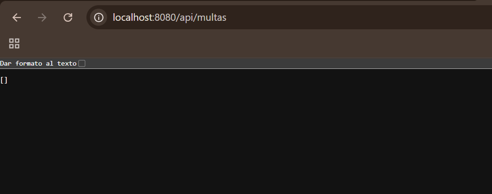
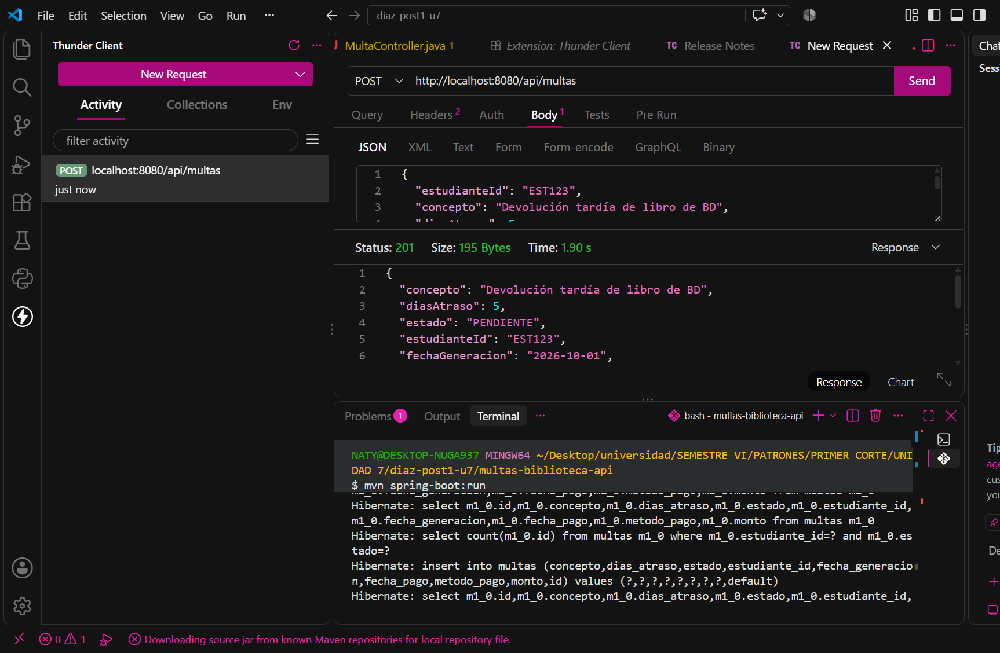
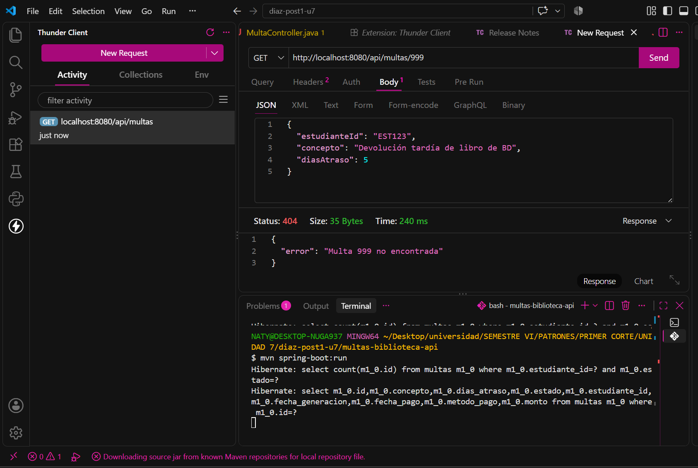
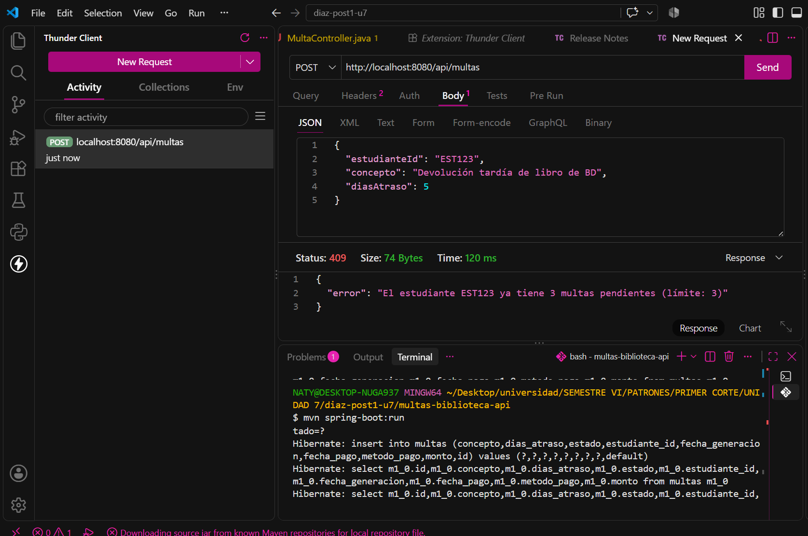
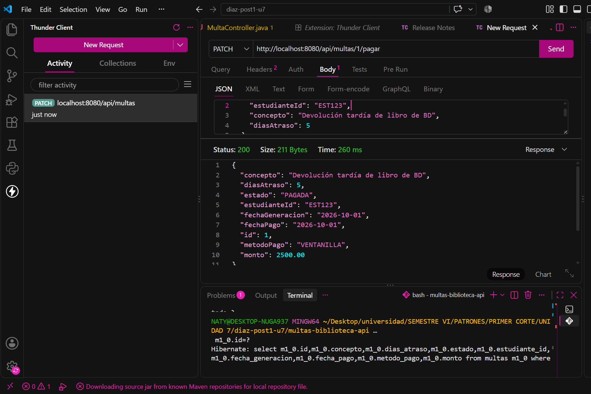
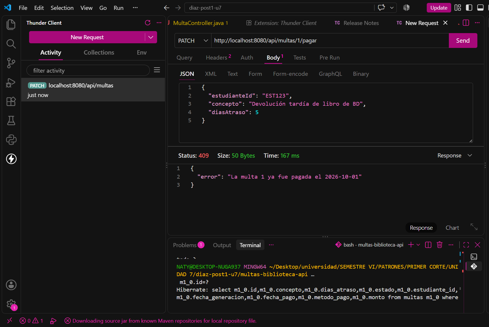
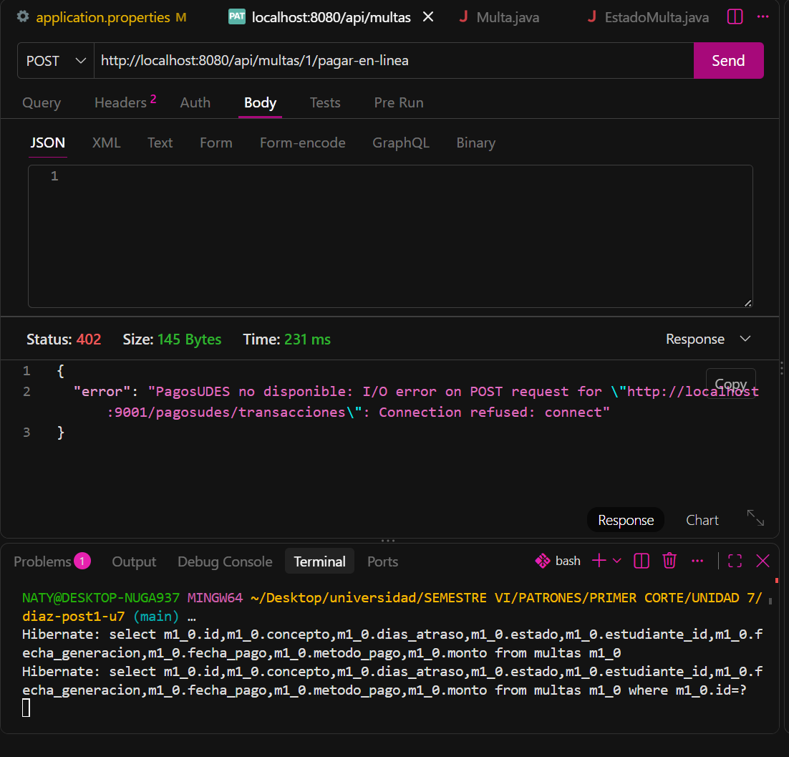
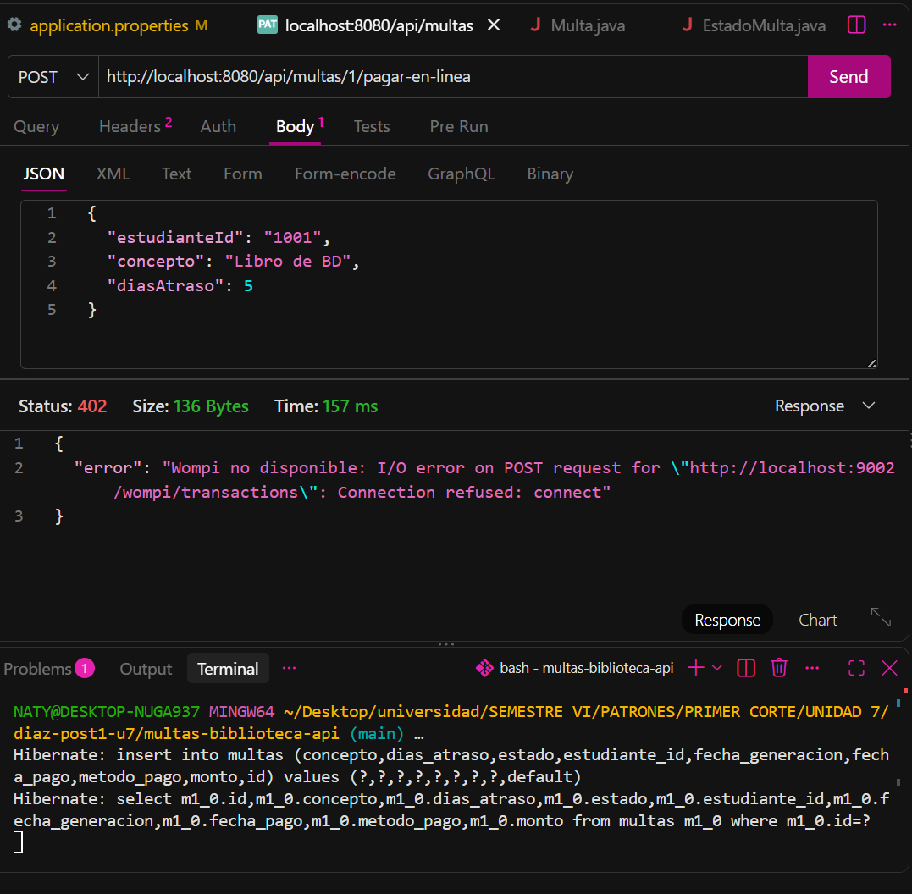
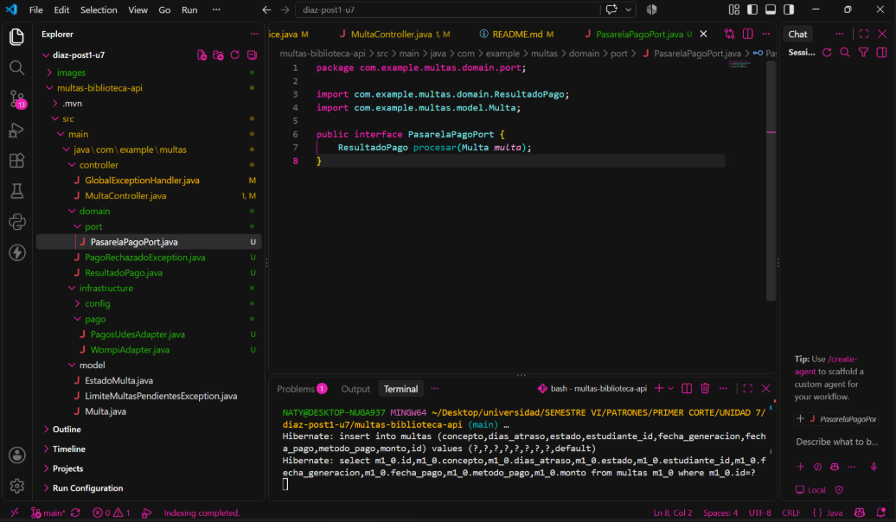

# Sistema de Gestión de Multas - Biblioteca API

**Estudiante:** Natalia Díaz Villamizar  
**Asignatura:** Patrones de Diseño / Ingeniería de Software  
**Repositorio:** https://github.com/Nattss1311/diaz-post1-u7.git

---

## Descripción del Proyecto
Un único proyecto Spring Boot (`multas-biblioteca-api`) para la gestión de multas de biblioteca que consta de dos partes:
1. **Parte 1:** API REST en capas sobre H2 con reglas de negocio para generación, límites de morosidad y pago en ventanilla.
2. **Parte 2:** Módulo de pago en línea desacoplado mediante arquitectura hexagonal (*Puertos y Adaptadores*) que permite intercambiar pasarelas de pago heterogéneas (**PagosUDES** y **Wompi**) dinámicamente mediante configuración.

---

## 1. Descripción de la Arquitectura en Capas y Hexagonal

El proyecto evoluciona desde una estructura en capas hacia un enfoque hexagonal en el módulo de pagos:

1. **`model` / `domain` (Capa de Dominio):** Contiene las entidades (`Multa`), los enums (`EstadoMulta`), los puertos (`PasarelaPagoPort`) y Value Objects / DTOs de dominio (`ResultadoPago`). Es Java puro, desacoplado de frameworks.
2. **`repository` (Capa de Acceso a Datos):** Interfaz `MultaRepository` que extiende de `JpaRepository` con consultas personalizadas como `countByEstudianteIdAndEstado`.
3. **`service` (Capa de Negocio):** Clase `MultaService` que orquesta las reglas de negocio (límite de multas pendientes, validaciones) y la comunicación con el puerto de pagos.
4. **`infrastructure` (Capa de Infraestructura):** Contiene las adaptaciones externas (`PagosUdesAdapter`, `WompiAdapter`) que implementan `PasarelaPagoPort` y manejan la comunicación HTTP vía `RestTemplate`.
5. **`controller` (Capa de Presentación):** Expone los endpoints REST (`MultaController`) y captura excepciones globales (`GlobalExceptionHandler`).

---

## 2. Estructura de Paquetes
```bash
diaz-post1-u7/
├── images/
└── multas-biblioteca-api/
    ├── pom.xml
    └── src/main/java/com/example/multas/
        ├── controller/
        │   ├── MultaController.java
        │   └── GlobalExceptionHandler.java
        ├── domain/
        │   ├── PagoRechazadoException.java
        │   ├── ResultadoPago.java
        │   └── port/
        │       └── PasarelaPagoPort.java
        ├── infrastructure/
        │   ├── config/
        │   └── pago/
        │       ├── PagosUdesAdapter.java
        │       └── WompiAdapter.java
        ├── model/
        │   ├── EstadoMulta.java
        │   ├── LimiteMultasPendientesException.java
        │   ├── Multa.java
        │   ├── MultaNotFoundException.java
        │   └── MultaYaPagadaException.java
        ├── repository/
        │   └── MultaRepository.java
        └── service/
            └── MultaService.java
```
## 3. Instrucciones de Ejecución y Herramientas
### Herramientas utilizadas
**Lenguaje y Framework:** Java 17, Spring Boot 3.x, Spring Data JPA, H2, RestTemplate.

**Herramientas de Construcción y Prueba:** Apache Maven, Thunder Client / Postman, cURL.

**Control de Versiones:** Git, GitHub.

**Comandos de ejecución**
Clonar el repositorio:

```Bash
git clone [https://github.com/Nattss1311/diaz-post1-u7.git](https://github.com/Nattss1311/diaz-post1-u7.git)
cd diaz-post1-u7/multas-biblioteca-api
Compilar el proyecto:
```
```Bash
mvn clean compile
Ejecutar la aplicación:
```
```Bash
mvn spring-boot:run
```
`La API estará disponible en http://localhost:8080/api/multas.`

## 4. Decisiones de Arquitectura y Diseño
### Punto de Decisión 1 — Cálculo del monto: ¿entidad o Service?

El cálculo del monto de la multa (días de atraso × valor por día) no requiere de colaboradores externos. Se optó por ubicar esta regla en el método estático Multa.calcularMonto dentro de la entidad Multa en lugar de alojarla en MultaService.

**Justificación:** Previene el antipatrón de Modelo Anémico. Al no necesitar el servicio ni el repositorio, la responsabilidad pertenece al dominio de la entidad, permitiendo reusarla libremente sin acoplarla a la capa de servicio.

## Punto de Decisión 2 — Conteo de multas pendientes: ¿consulta o filtrado en memoria?
Para validar si a un estudiante se le permite generar una nueva multa (límite de 3 pendientes), se implementó la consulta derivada `MultaRepository.countByEstudianteIdAndEstado.`

**Justificación:** Delega la agregación al motor relacional mediante SQL `(COUNT)`, garantizando rendimiento $O(1)$ a nivel de aplicación en lugar de cargar el historial completo en memoria mediante Streams.

## Punto de Decisión 3 — Selección del adaptador activo

Se seleccionó la Opción C *(Puerto de Dominio con Adaptadores)*. La inyección del adaptador activo `(PagosUdesAdapter o WompiAdapter)` se resuelve mediante `@ConditionalOnProperty(prefix = "app.pagos", name = "proveedor")`.

**Justificación:** Permite que MultaService dependa únicamente de PasarelaPagoPort sin condicionales (if/switch) ni `@Qualifier`. El cambio entre pasarelas se logra modificando application.properties sin necesidad de re-compilar el código.

## Punto de Decisión 4 — Diseño del puerto y tipo de resultado agnóstico (ResultadoPago)

Tanto PagosUdesAdapter como WompiAdapter manejan contratos heterogéneos (idTransaccion frente a montos en centavos y reference). Ambos adaptadores traducen sus respuestas al modelo neutro ResultadoPago.

**Justificación:** Preserva la frontera del dominio. Si el puerto devolviese DTOs externos, la capa de servicio se contaminaría con detalles de infraestructura técnica de terceros.

## Trade-off Considerado (Parte 2)

Se descartó el uso de condicionales en servicio (Opción A) e interfaces tradicionales en capas (Opción B) a favor de Puertos y Adaptadores (Opción C).

**Lo que se ganó:** Desacoplamiento total, cumplimiento del principio Open/Closed y facilidad de pruebas.

**Costo adicional:** Mayor número de clases/archivos y pequeña curva de aprendizaje.

**Conclusión:** Aún si el piloto terminara y quedara una sola pasarela, la abstracción se mantendría para facilitar pruebas con mocks e integraciones futuras.

## 5. Conclusiones

La evolución de la aplicación demostró el valor de separar responsabilidades desde las etapas iniciales del software. Al aislar la lógica del dominio de la infraestructura en la Parte 2 mediante un puerto agnóstico, se logró integrar pasarelas de pago externas totalmente heterogéneas sin alterar ni una sola línea de lógica del núcleo de negocio ni de la API REST. Esta experiencia evidencia cómo los patrones de arquitectura hexagonal protegen al sistema contra cambios tecnológicos futuros en dependencias de terceros.

## 6. Evidencias de Pruebas y Checkpoints
A continuación se presentan las capturas de pantalla organizadas por etapa del laboratorio:

### Parte 1 — Checkpoints API REST
### Parte 1 — Checkpoints API REST

| Descripción | Imagen |
| :--- | :--- |
| **GET /api/multas (200 OK):** Consulta inicial de multas. |  |
| **POST /api/multas (201 Created):** Generación exitosa de multa. |  |
| **POST /api/multas (400 Bad Request):** Validación de datos de entrada. |  |
| **GET /api/multas/{id} (404 Not Found):** Búsqueda de multa inexistente. |  |
| **POST /api/multas (409 Conflict):** Límite de multas pendientes superado. |  |
| **PATCH /api/multas/{id}/pagar (200 OK):** Pago exitoso en ventanilla. |  |
| **PATCH /api/multas/{id}/pagar (409 Conflict):** Intento de re-pago en ventanilla. |  |

---

### Parte 2 — Checkpoints Pago en Línea (Adapter / Hexagonal)

| Descripción | Imagen |
| :--- | :--- |
| **PagosUDES Adapter (402 Payment Required):** Ejecución con `app.pagos.proveedor=pagosudes`. |  |
| **Wompi Adapter (402 Payment Required):** Ejecución con `app.pagos.proveedor=wompi`. |  |
| **Independencia del Dominio:** Verificación del archivo `PasarelaPagoPort.java` sin importaciones de Spring. |  |